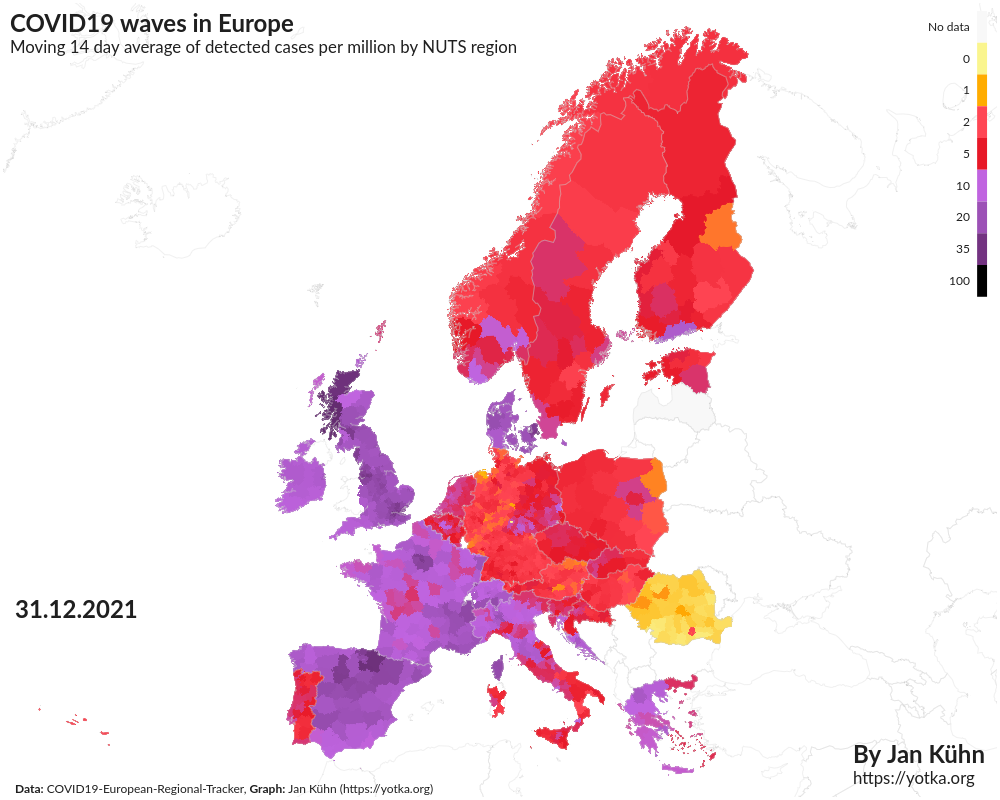
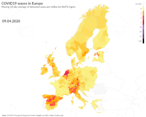
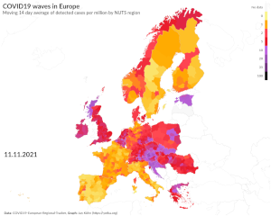
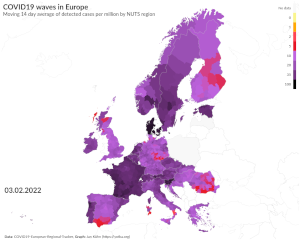

# CovidWaves
_A data visualisation project by [Jan Kühn](https://yotka.org), September 2022_

## What is this about?

After more than two years of living with the pandemic of the new Corona virus Sars-CoV2 one thing we know for sure is that **the virus spreads in waves**. But how do those waves spread across a continent – in this case Europe – that has many countries and even more policies to deal with the threat of this new pathogen? I used data to try to answer that question. The result is an animation of detected Covid19 cases throughout the time period from February 2020 to June 2022.

## About the data

For Covid19 cases, I used data of the (great!) [**COVID19-European-Regional-Tracker**](https://github.com/asjadnaqvi/COVID19-European-Regional-Tracker). It's a project that collected data from many different sources and adapted them to Eurostat's geographic [**NUTS regions**](https://ec.europa.eu/eurostat/web/nuts/background) (the so called "Nomenclature of territorial units for statistics" (NUTS)) in its 2016 version (why not 2021, you ask? [Read more here](https://github.com/asjadnaqvi/COVID19-European-Regional-Tracker#combining-data-across-countries)).

## About the script(s)

The main script `main.py` creates an animation of the data using Plotly Choropleth Mapbox and GeoJson files provided by Eurostat. The script allows to define different characteristics of the animation like time frame, metrics, speed (frames per second), map details etc. in the file `settings.py`.

By default, the script uses a dataset that has already been cleaned by `update_data.py` (`data/covid-waves-data-clean.csv`). It cleans the Covid19 data removing some extreme outliers and values below zero (both due to data corrections) and correcting some [erroneous dates](https://github.com/asjadnaqvi/COVID19-European-Regional-Tracker/issues/1) (years 2222 and 2121). It then adds missing dates for each NUTS region and interpolates missing values between known data points. In a last step before the export, different metrics are calculated both for daily data and for weekly aggregated data.

In `settings.py`, the cleaning process can be set to be repeated (setting: `update_data: True`). In that case, the original data in `data/european-regional-tracker.csv` is imported and cleaned as described above.

## Use of colors

Defining **colors and break points** for this dataset is rather challenging, because the magnitude of detected cases varies a lot both over time and geographically. For that reason, analyzing the data I chose to use red as the 'medium' color and dark purple to black as the maximum. The break points are **quantiles** at 20%, 40%, 60%, 80%, 90%, 95%, and 99%. 

That way, during the **first waves** of the pandemic in 2020, maximum numbers are reaching the **red area** while **later on** (especially with much more contagious variants like Omikron) maximums are **dark purple to black**. This allows for differentiation both in the first and in later waves.

## Caveats

COVID-19 data has many caveats and actually it's difficult to compare countries, especially regarding detected cases. Different testing policies leading to different numbers of tests and different criteria of who to test distort the numbers not only between countries, but also between different points in time, as policies change. Also, higher numbers of detected cases don't necessarily translate to the same increase in hospital admissions or deaths from COVID-19. 

But even taking into account those caveats, the data shows some interesting trends. At some moments during the pandemic, COVID-19 waves seem to spread through the continent (almost) regardless of borders. This happened, for example after June 2021 when detected cases started to rise steeply on the Iberian Peninsula and then "moved" to France in Summer and the rest of Europe in December/January, just to "send back" an even bigger wave in January/February 2022:

